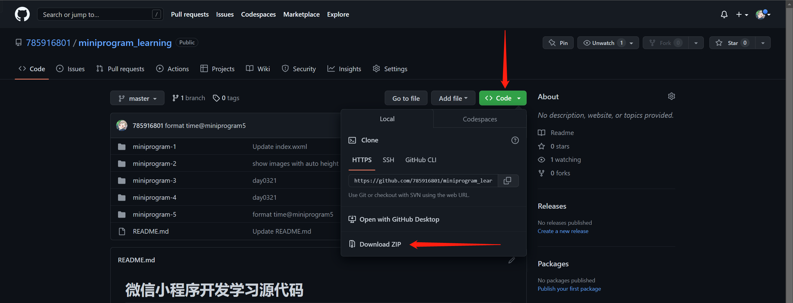

# 微信小程序开发学习源代码
## 目录
1. [天气首页](miniprogram-1/)
2. [swiper视图](miniprogram-2/)
3. [联系人首字母索引](miniprogram-3/)
4. [尝试wx.request获取数据](miniprogram-4/)
5. [mv页面with网易云音乐API](miniprogram-5/)
## 获取代码方法
### 使用Git Clone命令
您可以在安装了Git的电脑上打开命令提示符，输入以下命令
`git clone https://github.com/785916801/miniprogram_learning.git`
并回车，即可获取本项目的所有源代码
### 下载本项目的压缩包

如图所示
### 查看每个项目的源代码
点击目录中的项目即可前往